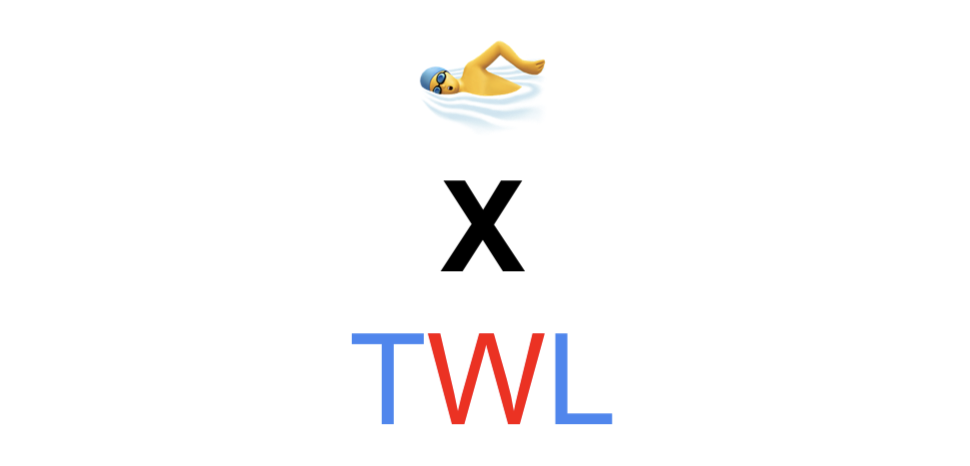

# 2021-SwimmingXTWL

ver 2021 

<h1 align="center">
	
	  Today We Learn
</h1>

  

## 개요

>  **해당 레포지토리** 사용은 TWL(Today We Learn) 을 목적으로 IT관련 자유롭게 주제를 선정하여 게시글을 올리게 되면 한명 한명이 지식전달자로 다른 사람들의 부족한 점을 채우는 과정들로 완성됩니다.  

📕. TWL 은 TIL에서 살짝 변경한 것입니다. 

TIL에 대한 정의가 낯설다면, 

- [TIL이란](http://milooy.github.io/TIL/ETC/daily-commit.html)

## 목차

example>

- [자바스크립트](#자바스크립트)

### 자바스크립트

- [Map과 Reduce의차이]